# **TALLER DE TRABAJO INDIVIDUAL EN PATRONES ARQUITECTURALES**
Primera parte: AWS


## Getting Started

These instructions will get you a copy of the project up and running on your local machine for development and testing purposes.

### Prerequisites

What things you need to install the software and how to install them
Para hacer uso de la aplicación necesitarás tener instalado el siguiente software
- [JDK](https://www.oracle.com/co/java/technologies/javase/javase8-archive-downloads.html) version 1.8.x
- [Maven](https://maven.apache.org/download.cgi)
- [Git](https://git-scm.com/downloads)


### Installing

Para obtener una copia de la aplicación deberás clonar este repositorio. Ingresa la siguiente instrucción en Git Bash:

```
git clone https://github.com/stefania5964/taller5.git
```

Luego, ejecuta el siguiente comando para compilar y empaquetar todo el proyecto:

```
mvn package
```

1. Cree una aplicación web, cree la imagen docker , suba la imagen a dockerhub
   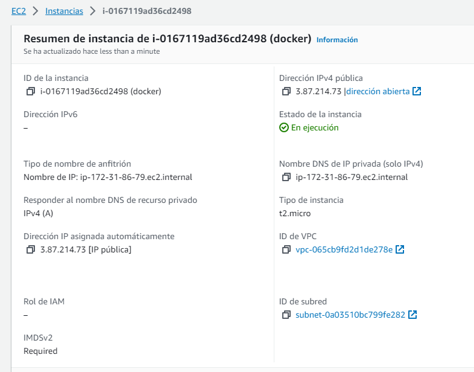
2. Acceda a la máquina virtual
   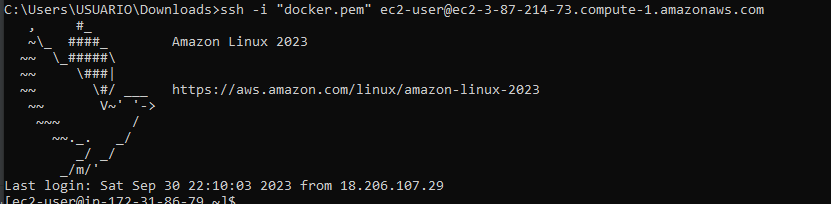
3. Instale Docker
   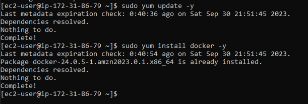
4. Inicie el servicio de docker
   ```
   sudo service docker start
   ```
   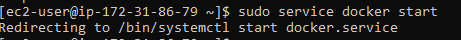
   
5. Configure su usuario en el grupo de docker para no tener que ingresar “sudo” cada vez que invoca un comando
   ```
   sudo usermod -a -G docker ec2-user
   ```
   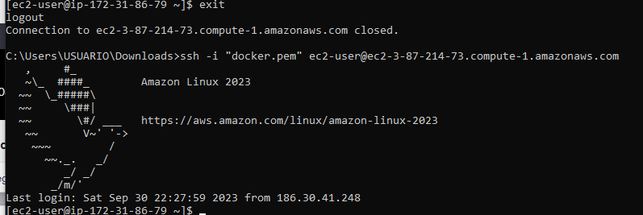
6. Desconectes de la máquina virtual e ingrese nuevamente para que la configuración de grupos de usuarios tenga efecto.
7. A partir de la imagen creada en Dockerhub cree una instancia de un contenedor docker independiente de la consola (opción “-d”) y con el puerto 6000 enlazado a un puerto físico de su máquina (opción -p):
   ```
   docker run -d -p 42000:6000 --name firstdockerimageaws dnielben/firstsprkwebapprepo
   ```
   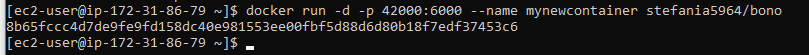
8. Abra los puertos de entrada del security group de la máxima virtual para acceder al servicio
9. Verifique que pueda acceder  en una url similar a esta (la url específica depende de los valores de su maquina virtual EC2)

   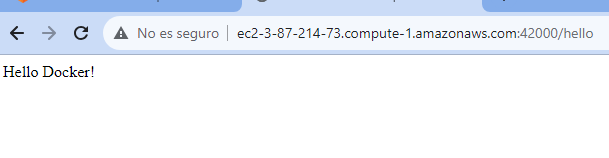
## Para la tarea usted debe construir una aplicación con la arquitectura propuesta y desplegarla en AWS usando EC2 y Docker.
### APP-LB-RoundRobin
aplicación web que utiliza un algoritmo de balanceo de carga de Round Robin para distribuir las solicitudes entre múltiples instancias de un servicio REST

### LogService
servicio REST que recibe cadenas de texto, las almacena en una base de datos ( MongoDB) y responde con un objeto JSON que contiene las 10 últimas cadenas almacenadas junto con sus fechas de almacenamiento.

### MongoDB
Base de datos no relacional creada a partir de la imagen  de Docker.

## **Virtualización local**
Para virtualizar y probar localmente el proyecto se hizo de la siguiente manera:

1. DockerFile: Se crearon dos archivos DockerFile, uno para **APP-LB-RoundRobin** y otro para **LogService**.

    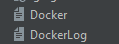

    

2. En el archivo ```docker.yml``` estan los servicios con puertos .

    ```
    version: '2'


    services:
    web:
        build:
        context: .
        dockerfile: Docker
        container_name: web
        ports:
        - "42000:6000"
    db:
        image: mongo:3.6.1
        container_name: db
        volumes:
        - mongodb:/data/db
        - mongodb_config:/data/configdb
        ports:
        - 27017:27017
        command: mongod
    log1:
        build:
        context: .
        dockerfile: DockerLog
        container_name: LogService1
        ports:
        - "35001:6000"
    log2:
        build:
        context: .
        dockerfile: DockerLog
        container_name: LogService2
        ports:
        - "35002:6000"
    log3:
        build:
        context: .
        dockerfile: DockerLog
        container_name: LogService3
        ports:
        - "35003:6000"

    volumes:
    mongodb:
    mongodb_config:
    ```

3. Use docker-compose para generar automáticamente una configuración docker como container o instancia  ```docker-compose build``` y ```docker-compose up -d``` para crear las instancias de los contenedores con las imágenes antes especificadas.

    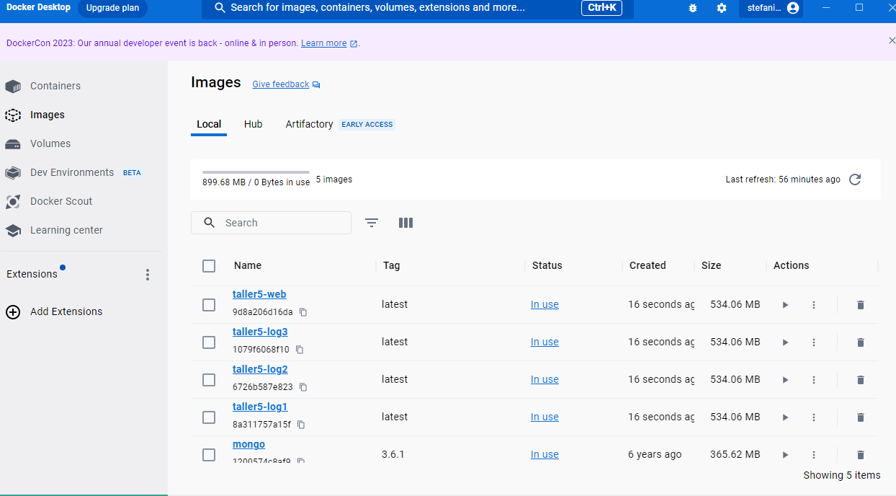


4. Se requiere modificar el grupo de seguridad agregando una regla de entrada para permitir conexiones mediante el puerto 4567.

    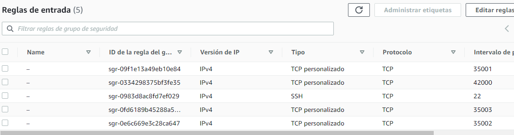
5. subimos las imagenes a docker hub
   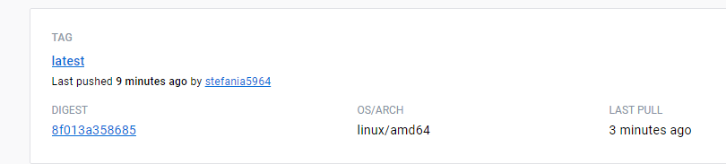
6. lo subimos a aws
   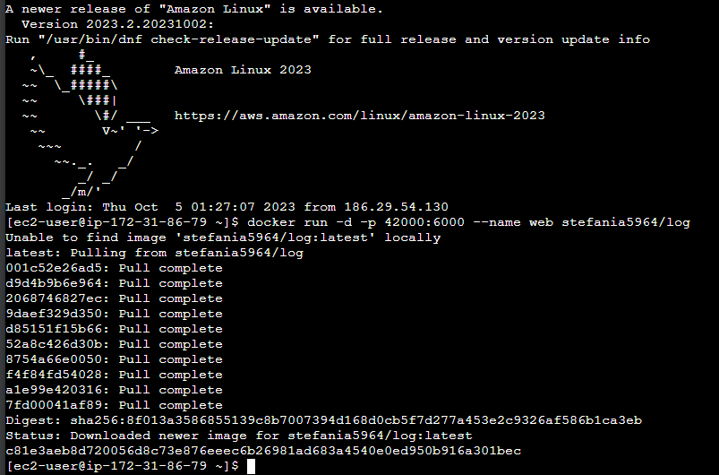
SORRY NO SE QUE PASO CON MI DOCKER Y ME DEJO DE FUNCIONAR NO ALCANCE A GRABAR

